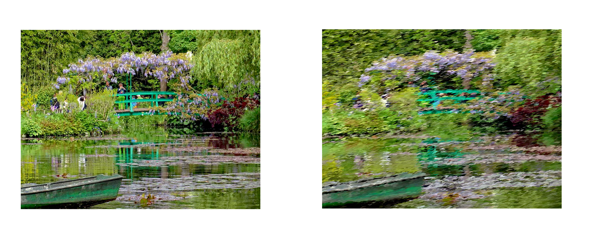

#
## Impressionism Filter
 Yuanbo Li

## Intro
This is an implementation of [Processing Images and Video for An Impressionist Effect, Litwinowicz, SIGGRAPH 1997](https://citeseerx.ist.psu.edu/viewdoc/summary?doi=10.1.1.471.9691).
The UI is borrowed from homework code of [CSCI 1230, Brown University](https://csci1230.graphics/#local:2adf7699bbb83), with all original homework solutions deleted.

The project will take one image as input, and turn it to an Impressionism style painting. Here is an example result:

<p\> 

## Process

### Step0

Choose a photo that Monet might be interested in drawing. 

<p\> 

### Step1

Apply brush strokes to original image. Apply brush strokes in every two points, so it would cover the whole image. Each stroke have radius randomly chosen from [1,3] 
and length chosen from [4,10], expanding in direction 0.78 radian.

<p\> 

### Step2

Many strokes generated by step1 expands beyond its own color zone. To fix this problem, we apply the following steps:

2.1 Blur the image with an Gaussian Kernel

2.2 Apply Sobel filter to detect gradient change.

2.3 For each pixel in the image, calculate delta_Intensity = (30*r + 59*g + 11*b)/100. If delta_Intensity>180, the pixel is in an edge; otherwise it is not.
(You can define how strong the edge should be, and it should be different when the input image changes. 180 is the best for the testing image, but may not
work well on new images.)

2.4 Whenever a brush stroke encounter an edge pixel, stop. This is why most strokes have smaller radius and length after this step.

<p\> 
 
 This is the result of edge detection.

<p\> 

### Step3

However, great artists never use strokes only in one direction. And the brush strokes are going to the direction where the color changes least.

3.1 Calculate gradient change again (Gx, Gy). The gradient is the direction of most change, and normal to the gradient is the direction of zero change.
It is suggested to use a Gaussian kernel with radius 4 pixels greater at this step, yet I chose to use the same kernel as the one used in step2.

3.2 Calculate the new direction of strokes. theta = arctan(Gy/Gx) + 1.57rad

<p\> 

### Step4

Color has very little change, or zero change, in certain pixels. Thus while both Gx and Gy are small, arctan(Gy/Gx) may generate unexpected values. We choose to interpolate these pixels'colors using colors of nearby pixels.

<p\> 

### Optimization

The project is an O(n^2) algorithm, given the width and height of the input n.

There are tons of optimization can be done on this project. Currently each step is calculated seperatedly so that I can test the effect of each process. However, it's obviously possible to do all the calculations in one loop.

### More results

<p\> 

<p\> 
